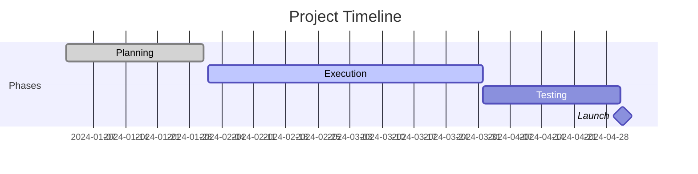

# 📋 <% tp.frontmatter.title %>

> **One-line description**: 

---

## 📊 Project Overview

| Field | Value |
|-------|-------|
| **Status** | `= this.status` |
| **Priority** | `= this.priority` |
| **Progress** | `= this.progress`% |
| **Start Date** | `= this.start-date` |
| **Deadline** | `= this.deadline` |
| **Area** | `= this.area` |
| **Owner** | <% tp.file.cursor(2) %> |

---

## 🎯 Objective & Success Criteria

### Main Objective


### Success Criteria
- [ ] 
- [ ] 
- [ ] 

### Key Results (OKRs)
1. **KR1**: 
2. **KR2**: 
3. **KR3**: 

---

## 📝 Project Description

### Context & Background


### Problem Statement


### Proposed Solution


---

## 👥 Stakeholders

```dataview
TABLE role, contact
FROM "People"
WHERE contains(projects, this.file.name)
```

### Key Stakeholders
- **Sponsor**: 
- **Lead**: 
- **Team**: 
- **Clients**: 

---

## 📅 Timeline & Milestones



### Major Milestones
- [ ] **M1**: [Milestone 1] - Due: 
- [ ] **M2**: [Milestone 2] - Due: 
- [ ] **M3**: [Milestone 3] - Due: 
- [ ] **M4**: [Milestone 4] - Due: 

---

## ✅ Tasks & Action Items

### 🔥 High Priority
```dataview
TASK
WHERE contains(text, this.file.name) AND priority = "high"
WHERE !completed
```

- [ ] #high 
- [ ] #high 

### 📌 Medium Priority
- [ ] #medium 
- [ ] #medium 

### 📝 Low Priority
- [ ] #low 

### ✔️ Completed Tasks
```dataview
TASK
WHERE contains(text, this.file.name)
WHERE completed
SORT completion DESC
LIMIT 10
```

---

## 📦 Deliverables

| Deliverable | Owner | Due Date | Status |
|-------------|-------|----------|--------|
| | | | ⏳ |
| | | | ⏳ |
| | | | ⏳ |

---

## 🧩 Dependencies

### Blocked By
- [ ] 

### Blocking
- [ ] 

### External Dependencies
- 

---

## 💰 Budget & Resources

### Budget
- **Estimated**: 
- **Actual**: 
- **Remaining**: 

### Resources Needed
- **People**: 
- **Tools**: 
- **Materials**: 

---

## 📊 Progress Tracking

### Current Status


### Recent Updates
- **<% tp.date.now("YYYY-MM-DD") %>**: 

### Blockers & Risks
| Risk | Impact | Probability | Mitigation |
|------|--------|-------------|------------|
| | High/Med/Low | High/Med/Low | |

---

## 🔄 Weekly Check-ins

### Week of <% tp.date.now("YYYY-MM-DD") %>

#### Completed This Week
- 

#### In Progress
- 

#### Planned for Next Week
- 

#### Issues & Blockers
- 

---

## 📁 Related Documents

### Documentation
- [[]] - 
- [[]] - 

### Meeting Notes
```dataview
LIST
FROM "Meetings"
WHERE contains(projects, this.file.name)
SORT file.ctime DESC
LIMIT 5
```

### Reference Materials
- 

---

## 💡 Ideas & Notes

### Brainstorming


### Decisions Made
- **<% tp.date.now("YYYY-MM-DD") %>**: 

---

## 🎓 Lessons Learned

### What Worked Well
- 

### What Didn't Work
- 

### What to Try Next Time
- 

---

## 📈 Metrics & KPIs

| Metric | Target | Current | Status |
|--------|--------|---------|--------|
| | | | 🟢🟡🔴 |
| | | | 🟢🟡🔴 |
| | | | 🟢🟡🔴 |

---

## 🔗 Related Projects

```dataview
TABLE status, priority, progress as "Progress %", deadline
FROM "Projects"
WHERE file.name != this.file.name
  AND (contains(tags, "project/active") OR status = "active")
SORT priority DESC, deadline ASC
```

---

## 🏁 Project Closure

### Final Results


### Success Evaluation


### Handoff Notes


---

## 📎 Attachments

- 

---

## 🏷️ Metadata

**Created**: <% tp.date.now("YYYY-MM-DD HH:mm") %>  
**Last Updated**: <% tp.date.now("YYYY-MM-DD HH:mm") %>  
**Version**: 1.0  
**Template**: project.md

---

## Quick Actions

- [ ] Schedule kickoff meeting
- [ ] Create project channel
- [ ] Set up tracking system
- [ ] Assign roles
- [ ] Review with stakeholders